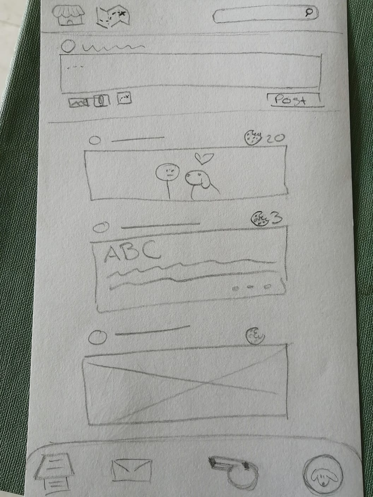
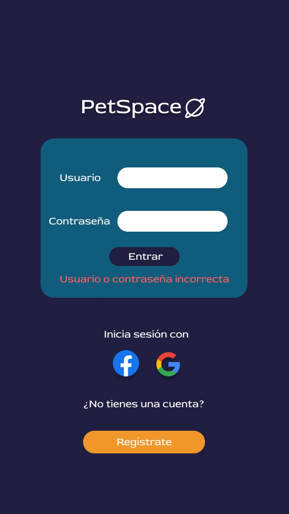
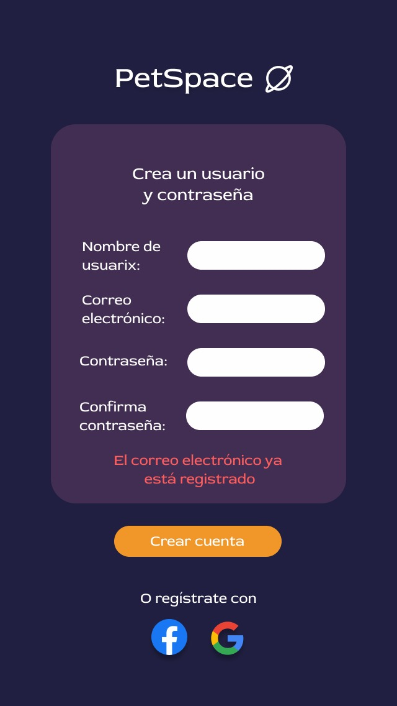
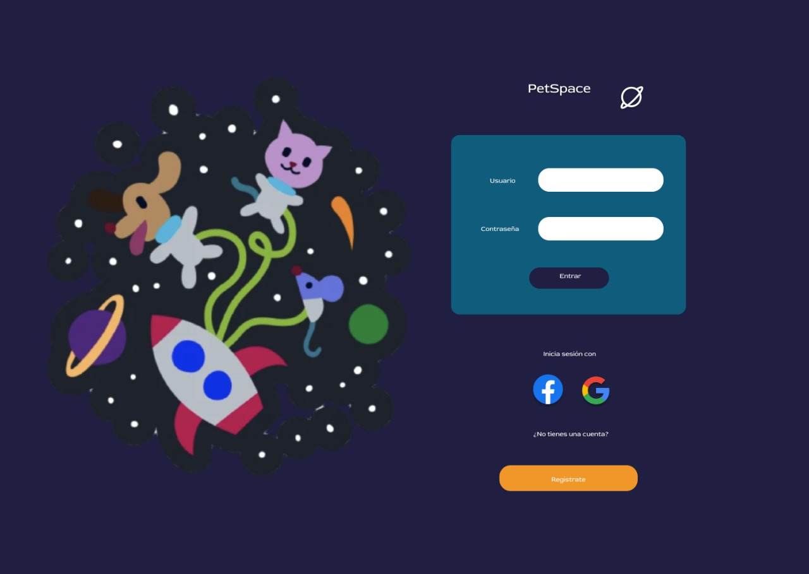
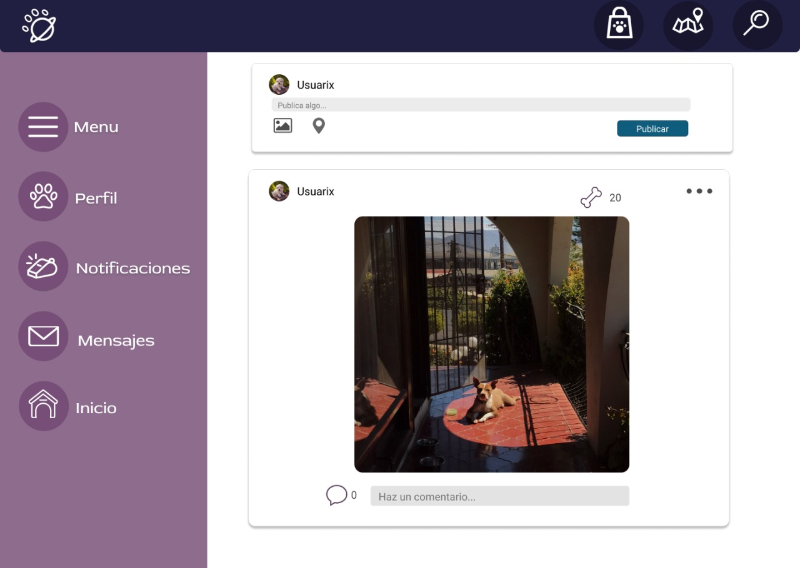

# Creando una Red Social: Pet Space

## Índice

* [1. Descripción del proyecto](#1-descripcion-del-proyecto)
* [2. Diseño](#2-diseño)

## 1. Descripción del proyecto

PetSpace es una red social para conectar cuidadorxs de mascotas, y así poder acceder y compartir a servicios avalados por la misma comunidad. El desarrollo de este proyecto, se llevó acabo a partir de las siguientes Historias de Usuario:

HU1: Yo como usuarix de PetSpace quiero crear una cuenta con correo electrónico.

HU2: Yo como usuarix de PetSpace quiero poder acceder con la cuenta creada.

HU3: Yo como usuarix de PetSpace quiero poder acceder con mi cuenta de Facebook y Gmail.

HU4: Yo como usuarix de PetSpace quiero poder acceder a mi timeline una vez que inicie sesión.

HU5: Yo como usuarix de PetSpace quiero que mis publicaciones se guarden aunque cierre sesión.

HU6: Yo como usuarix de PetSpace, quiero poder dar likes a publicaciones.

HU7: Yo como usuarix de PetSpace, quiero poder eliminar mis publicaciones.

HU8: Yo como usuarix de PetSpace, quiero poder editar mis publicaciones.

PetSpace fue desarrollado como una Single Page Application, con diseño responsivo (mobile first) e implementando Firebase (Authentication para inicio de sesión y registro de usuarixs, y FireStore para la creación y manipulcación de datos).

## 2. Diseño

Primeramente, se realizaron prototipos de baja fidelidad que sirvieron como base para aterrizar el concepto.

Posteriormente, trasladamos los diseños a la plataforma Figma, donde realizamos los prototipos de alta fidelidad, con el objetivo de hacer testeos de usabilidad y recibir retroalimentación por parte de lxs usuarixs. La iteración de los comentarios recibidos al diseño original, dio como resultado los siguientes prototipos.

